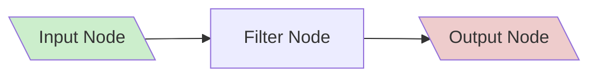
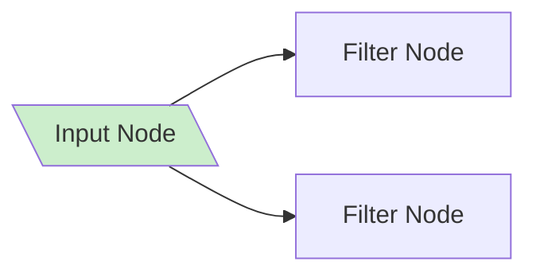
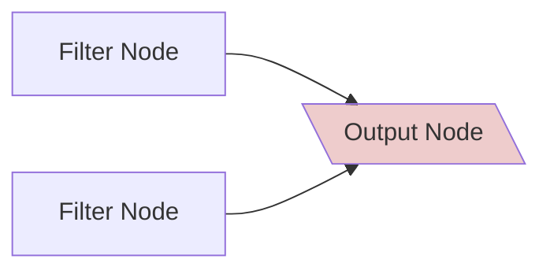
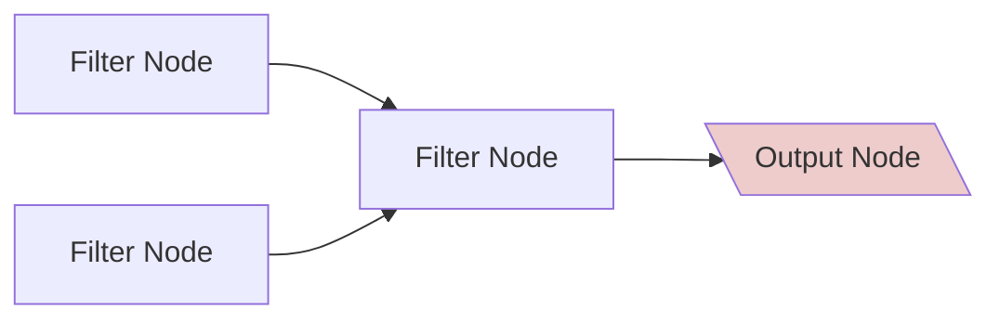
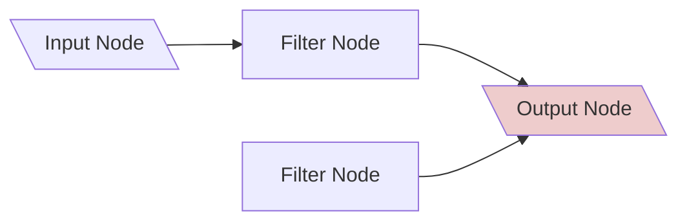
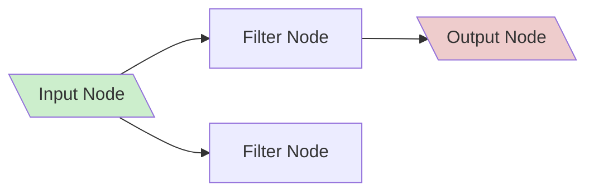
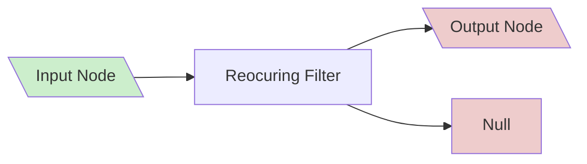
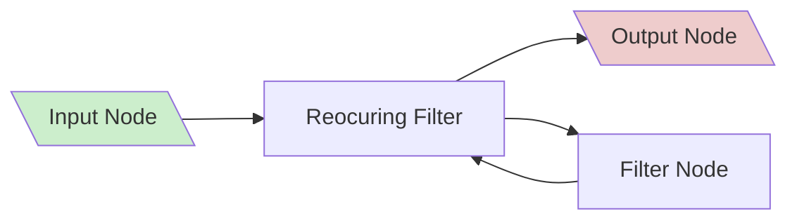
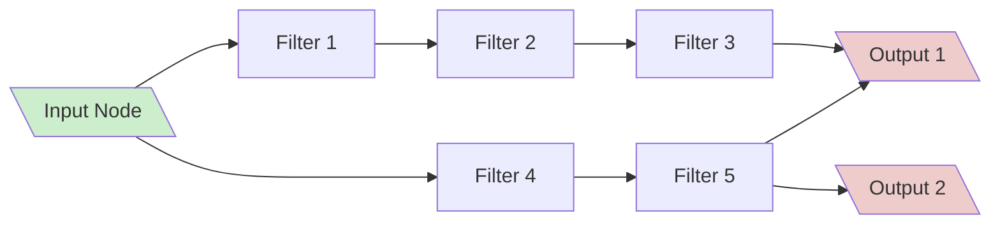

# Filter Language

based on the [icalendar standard RFC 2445](https://www.rfc-editor.org/rfc/rfc2445)

## General shape

The CSF is graph based. With three generall types of nodes. 
### Input Nodes
Are the onyl Nodes allowed to access outside information. There primary use is to provide calendar compoents form outside sources. 
Alternative they may use the network, time, random or other outside resources.
The should not change any outside resource.
Input Nodes That use the same resources must all give the same output.
### Filter Nodes
can change, delete or add Nodes to a list of components. They must only use information provide to them via the Gaph.
### Output Nodes
Push changes to outside calendars or provide them them selfs.

The graph must be deterministic. Meaning for the same given inputs percived by all the input nodes. The output nodes must push or provide the same information.
Also the result on the target of the output Nodes should be deterministic as well.

At the start of the graph run all input nodes gather their Data. After that the filter Nodes get executed. When the filter Nodes are all finished the Output Nodes provide or push their data.

The most simple workflow is:

The next extension would be multiple Filter Nodes in a row.

But you dont have to just do 1:1 relations. There Also splits.
Here the components are getting copied. So both Filter Nodes are getting the same input

The Reverse are merges

This essentially a set union. But two components have to be exactly equal. If you need a differen behaviour you need a filter nodes that does that

### Forbbiden
A filter graph must have an input and an output for all paths. So these are forbbiden.

If you want these behavior you might implement a null Input or output. to explicitly state such a behavior. For Example if yopu have a Node with two outputs that put reorurring events out of the first and others out of the second. But i want to delete the later you can do this.

Completly forbbiden are loops, a worker must check for loops before running and reject all operations. 

Also forbbiden are disconnected subgraphs.

## Parallelisation
A worker can use parallelisation. But the paralisation must be joined at merge points and outputs. Also all Inputs have to be done before output happens.

In this example F1,F2 and F3 can run parralel to F4 and F5. But F1 has to run before F2 and F4 before F5 and so on.
Before output1 can run F3 and F5 have to be done. But it can run beside Output2

### Batch vs Stream Nodes
A Node should be a Stream Node. Where every incoming component is processed seperatly. A Batch Node must request that all Inputs are present, before it start executing. So it may use information of multiple components. While a Stream Node must not use any other information the the component at hand.
A Worker may execute any or all Stream Nodes like a Batch Node.

## Equality
Two components are *exactly equal* if They are of the same type and all explicit and unset attributes have the same values
