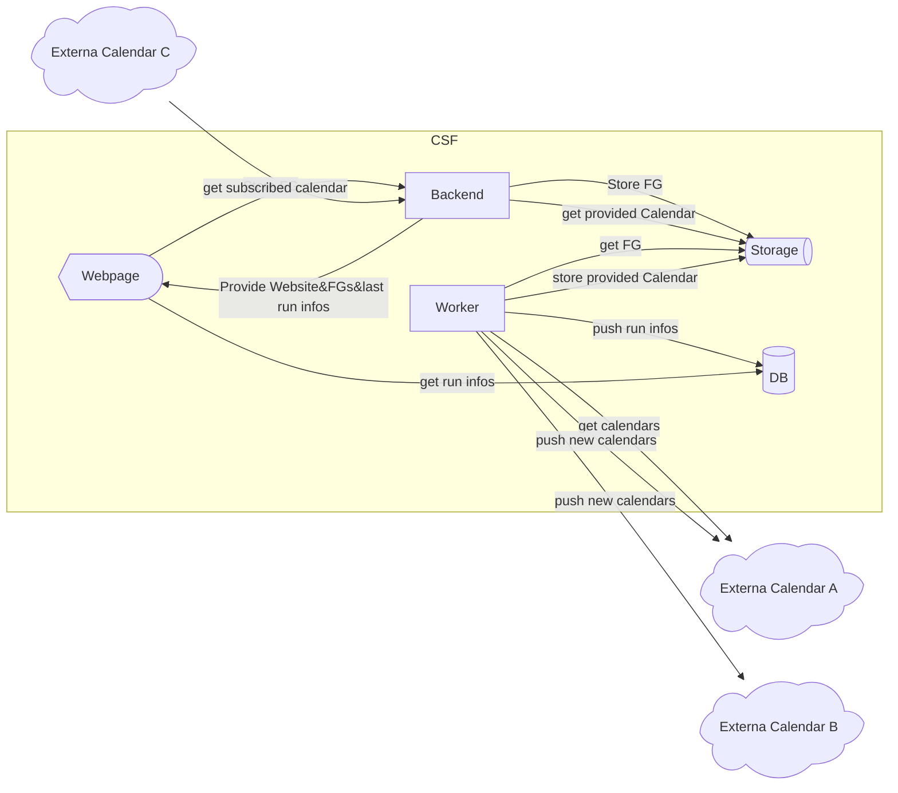

# CSF Documentation

```mermaid
flowchart LR
    subgraph CSF
    web@{ shape: display, label: "Webpage"}
    back[Backend]
    stor@{ shape: das, label: "Storage" }
    work@{ label: "Worker" }
    db@{ shape: cyl, label: "DB" }
    end
    res1@{ shape: cloud, label: "Externa Calendar A" }
    res2@{ shape: cloud, label: "Externa Calendar B" }
    res3@{ shape: cloud, label: "Externa Calendar C" }
    web--Store FG-->back
    back--Provide Website&FGs&last run infos-->web
    back--Store FG-->stor
    back--get provided Calendar-->stor
    work--get FG-->stor
    work--store provided Calendar-->stor
    work--get calendars-->res1
    work--push new calendars-->res1
    work--push new calendars-->res2
    work--push run infos-->db
    web--get run infos-->db
    res3--get subscribed calendar-->back
```